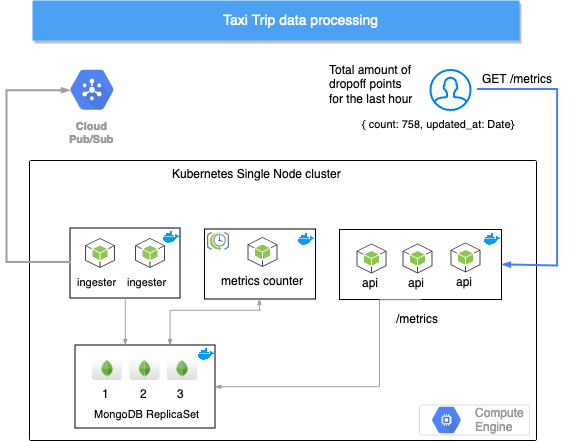
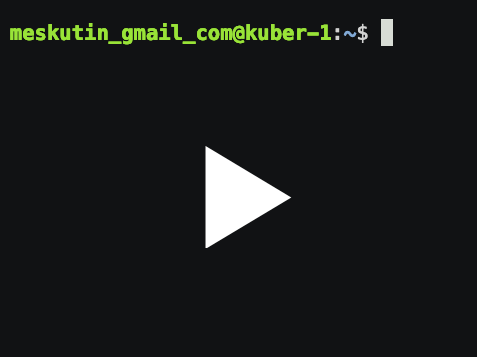

# Taxi Trip Data Processing

- [Taxi Trip Data Processing](#taxi-trip-data-processing)
  - [Technologies used and trade-offs made](#technologies-used-and-trade-offs-made)
  - [Architecture overview](#architecture-overview)
  - [Setup](#setup)
  - [Improvements](#improvements)

## Technologies used and trade-offs made

- NodeJS - Development simplicity of asyncronous applications
- MongoDB - Trade off was made not in favour of Redis due to scaling simplicity MongoDB replica set offers
- Docker - industry standard container engine
- Docker Compose - facilitates local development
- Helm - streamlines the process of creating multiple Kubernetes resources with charts templates. It also offers pre-packaged charts for popular open-source projects, like [mongodb replicaset](https://github.com/helm/charts/tree/master/stable/mongodb-replicaset) that was used in the setup
- Kubespray - provides more advanced automation options than kubeadm, offers suitable defaults, hence reduces amount of effort on developers side
- Kubernetes - cluster is not HA, single node cluster is setup due to requirement constraints: single VM with 4 Core, 8Gb RAM

## Architecture overview

Assignment details and problem statement can be found [here](docs/ASSIGNMENT.md).



1. Ingester - background worker, pubsub listener that ingests incoming taxi data into db
2. Counter  - background recurring job, calculates a total number of trips for the last one hour in a separate collection. **Only drop-off events are considered as a trip**
3. App API - Web service that provides taxi trips metrics as per user request

>Data ingested into trips collection is being stored for 2h, [housekeeping is done by `mongod` process](https://docs.mongodb.com/manual/core/index-ttl/).

## Setup

- Clone the repository
- Run `bash install.sh` ~12min

Once script work is finished you can start quering metrics api with the following command:

`curl $(kubectl get svc | grep taxi-app | awk '{print $3}')/metrics`

```json
{
  "updated_at": "2019-09-02T09:12:17.712Z",
  "dropoff": {
    "count": 152
  }
}
```

You may need to wait for a minute to let data get populated.

Refer to screencast:

[](https://asciinema.org/a/265563?t=2&speed=40&theme=solarized-dark&data-size=small)

>Setup was tested on the VM created from `ubuntu-1604-xenial-v20190816` image, refer to `docs/create_vm.sh` script.

## Improvements

Across the codebase a few TODOs have been left, those are enhancements that I'd ideally like to do for a production ready system.

Apart from the above, here are some other infrastructure/configuration/architecture improvements I feel neccessary:

- Create PV for mongodb, dynamic provisioning
- Update Helm chart notes
- Add liveness and readiness probes
- Add Cloud LoadBalancer
- Setup Private Registry
- Provision secrets properly
  - pubsub creds
  - mongodb creds
- Isolate project environments with namespaces
- Create Makefile to streamline building and pushing docker images
